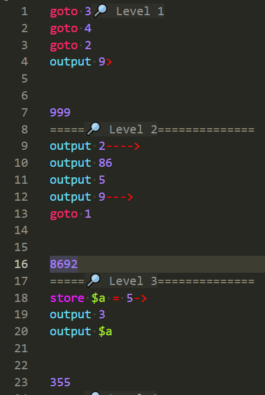

# yatc-shortcuts README

This VSCode Extension aids with creating levels for the game "You Are The Code" by ThinkWithGames. (I work on the game)

## Features

* Snippets for storing "Gems", "show" lines, and more
* Syntax highlighting for .yatc files (the file format for levels in You Are The Code)

* Go to defintion works on `enter level4` to go to the referenced level4 (this is a default shortcut in VSCode)
* Keyboard shortcuts:
    - goToDisplayOrder is alt+d
    - goUpAFolder is alt+q
    - goToLevelList is alt+l
    

## Requirements

To run your levels, you need to be using the full version of the game "You Are The Code". The game releases in July 2025, available here https://store.steampowered.com/app/3333330/You_Are_The_Code?utm_source=vscode, but for now you can play the demo version here: https://store.steampowered.com/app/3628770/You_Are_The_Code_Demo?utm_source=vscode

## Running

Launch debug mode while the extension.ts file is open (this has the prebuild task that compiles your typescript before launching a new editor that has the changes loaded)